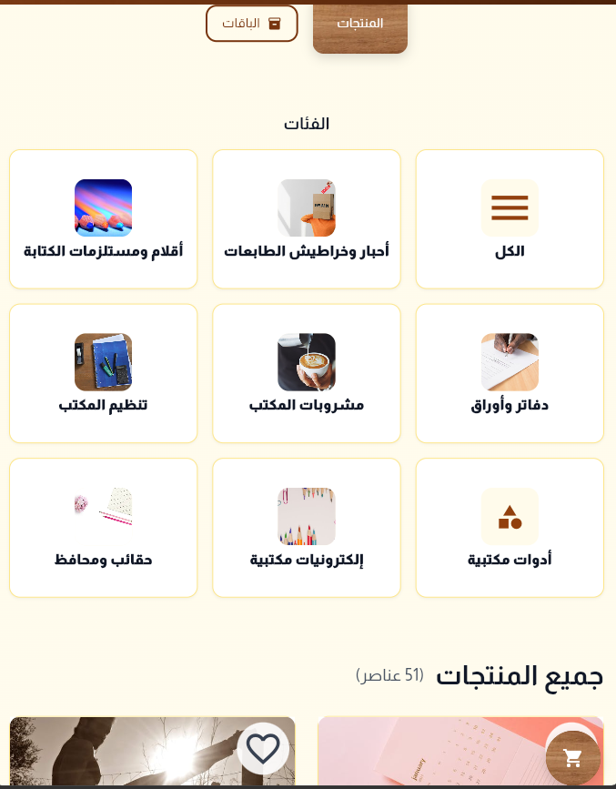

# 📚 Makateb Store Mobile Application

A premium e-commerce mobile application for **Makateb Store**, built with **Flutter** and **Dart**. This application offers a seamless shopping experience with a modern UI, high performance, and smooth animations.

---

## 👤 Developer
**Fawaz Allan**

---

## ✨ Features

- **🏠 Interactive Home Page**: Dynamic banners and featured products.
- **📂 Category Management**: Easy navigation through various product categories.
- **🛍️ Product Details**: Detailed product views with high-quality images and descriptions.
- **🛒 Shopping Cart**: Seamless cart management with real-time updates.
- **❤️ Wishlist**: Save your favorite products for later.
- **🌍 Multilingual Support**: Full support for both **Arabic** and **English** languages.
- **🌓 Dark/Light Mode**: User preference based theme switching.
- **⚡ Performance Optimized**: Fast loading times with cached network images and shimmer effects.
- **🎨 Modern UI/UX**: Built with Google Fonts (Almarai), Lottie animations, and Flutter Animate.

---

## 🛠️ Technology Stack

- **Framework**: [Flutter](https://flutter.dev/)
- **State Management**: [Riverpod](https://riverpod.dev/) (with Code Generation)
- **Navigation**: [GoRouter](https://pub.dev/packages/go_router)
- **Networking**: [Dio](https://pub.dev/packages/dio) & [HTTP](https://pub.dev/packages/http) (Laravel API Integration)
- **Storage**: [Shared Preferences](https://pub.dev/packages/shared_preferences) & [Flutter Secure Storage](https://pub.dev/packages/flutter_secure_storage)
- **UI/UX**: 
  - `flutter_svg` for vector graphics.
  - `cached_network_image` for efficient image loading.
  - `lottie` for interactive animations.
  - `shimmer` for loading states.
  - `google_fonts` (Almarai).

---

## 📸 Screenshots

| Home Page | Categories | Product Listing |
|:---:|:---:|:---:|
|  |  |  |

| Product Details | Shopping Cart | Wishlist |
|:---:|:---:|:---:|
|  |  |  |

---

## 🚀 Getting Started

### Prerequisites
- Flutter SDK (v3.10.7 or later)
- Dart SDK
- Android Studio / VS Code

### Installation
1. **Clone the repository**:
   ```bash
   git clone https://github.com/bourbon07/Mobile-application-projects.git
   ```
2. **Navigate to the project directory**:
   ```bash
   cd Makateb-Store-Mobile-application
   ```
3. **Install dependencies**:
   ```bash
   flutter pub get
   ```
4. **Run code generation** (for Riverpod):
   ```bash
   flutter pub run build_runner build --delete-conflicting-outputs
   ```
5. **Run the application**:
   ```bash
   flutter run
   ```

---

## 📁 Repository Structure
```text
lib/
├── core/           # Localization, Routing, Themes, Constants
├── features/       # Feature-based architecture (Home, Auth, Cart, etc.)
├── models/         # Data Models
├── providers/      # Riverpod State Providers
├── services/       # API and Storage Services
└── main.dart       # Entry point
```

---

## 📄 License
Internal use only. Developed by Fawaz Allan.
